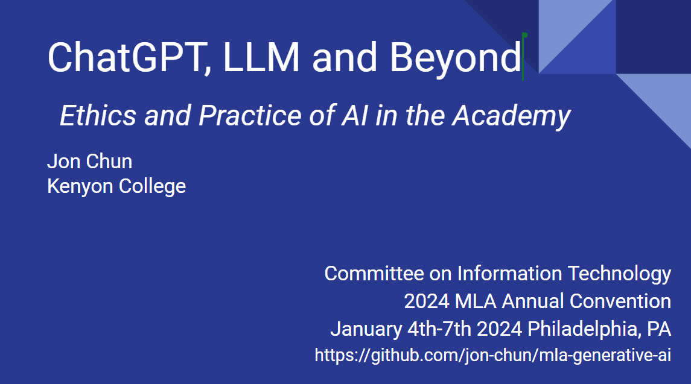

# Modern Language Association
* 2024 Conference
* Jan 4th - 7th
* Philadelphia, PA

## (Session 148 – Ethics and Practice of AIs in the Academy)[Session 148 – Ethics and Practice of AIs in the Academy]
* [MLA Committee on Technlogy Conference Webpage](https://infotech.mla.hcommons.org/2023/mla2024-s148/)
* 4 January 2024, 7:00 – 8:15 PM EST (Convention Program page)
* Marriott – Franklin 2
* Hashtags: #mla24, #s148

As artificial intelligences (AIs) in the form of “large language models” and similar models trained by neural networks (including but not limited to ChatGPT) become a presence in society, profound concerns arise about their ethical and practical use in the academy. This session focuses on what the professional and ethical position of higher education and associations such as the MLA is or should be given ever more capable AIs. What are practical, desired, and ethical uses of AIs by students, instructors, researchers, and administrators? Topics suggested in the original call for papers included: whether or how to make AIs part of academic work in the literature and language classroom; the stakes (and ways) of incorporating AIs in research or in such everyday academic business as writing recommendations, administrative memos, etc.; and how to grapple with the social, political, and economic implications of AIs in the academy.

### Presentation

* [ChatGPT, LLM and Beyond in *.ppt]("MLA_Conference_Philadelphia_20240104_Session148_EthicsPracticeAI_JonChun_LLMsChatGPT.pptx")

* [ChatGPT, LLM and Beyond in *.pd]("MLA_Conference_Philadelphia_20240104_Session148_EthicsPracticeAI_JonChun_LLMsChatGPT")

* [ChatGPT, LLM and Beyond in *.pdf with links]("MLA_Conference_Philadelphia_20240104_Session148_EthicsPracticeAI_JonChun_LLMsChatGPT_with_footnote_links")

### Description

As artificial intelligences (AIs) in the form of “large language models” and similar models trained by neural networks (including but not limited to ChatGPT) become a presence in society, profound concerns arise about their ethical and practical use in the academy. This session calls for presentations focusing on what the professional and ethical position of higher education and associations such as the MLA is or should be given ever more capable AIs. What are practical, desired, and ethical uses of AIs by students, instructors, researchers, and administrators? Presentation topics could include whether or how to make AIs part of academic work in the literature and language classroom; the stakes (and ways) of incorporating AIs in research or in such everyday academic business as writing recommendations, administrative memos, etc.; and how to grapple with the social, political, and economic implications of AIs in the academy.

### Comment

My goal is to provide clarifying mental models and give a concise overview of the sometimes confusing end-to-end implementation/use of ChatGPT/LLMs. As a result, I'll necessarily be eliding over many important details and useful resource links that listeners may want to refer to later. 

I hope my presentation can overcome some common misperceptions and spark both curiosity and better-grounded critiques of AI LLMs as research/teaching opportunities.

